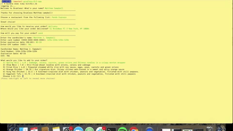

# Grubless
> Grubless is a CLI app that allows a customer to order food through their command line.

A CLI app that allows a user to order from a select number of restaurants in the Brooklyn area. A user is able to choose a restaurant, choose if they want their food delivered or whether it'll be a takeout order, choose the food, and select payment method. DISCLAIMER: Doesn't not allow a user to actually order food through the command line - this only mimics the process that would be necessary to order food through the command line. ALSO, it does not store or secure credit card information.



## Installation

OS X & Linux:

1) First, copy the SSH link, and run the command:

```sh
git clone <SSH key>
```

2) Next, go into the project directory & run the following command (if using Homebrew):

```sh
bundle
```

** If you're not using Homebrew, I would highly suggest installing it. Here is a great article that guides you step-by-step on how to install Homebrew on your computer. (http://osxdaily.com/2018/03/07/how-install-homebrew-mac-os/) **

3) Now that you've installed all the necessary dependencies run the following command to run the application:

```sh
bundle exec ruby bin/runner.rb
```

## Meta

Written By:

Matthew Campbell – matjocampbell@gmail.com

[https://github.com/campbelllssoup](https://github.com/campbelllssoup)

Jep Alorro - jep.alorro@flatironschool.com

[https://github.com/jralorro93](https://github.com/jralorro93)
